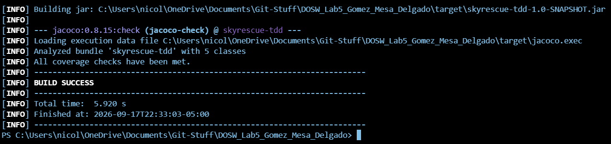
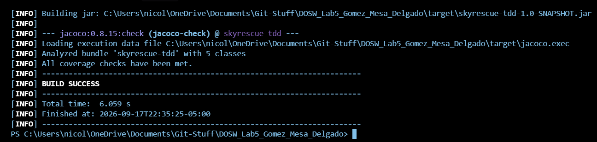
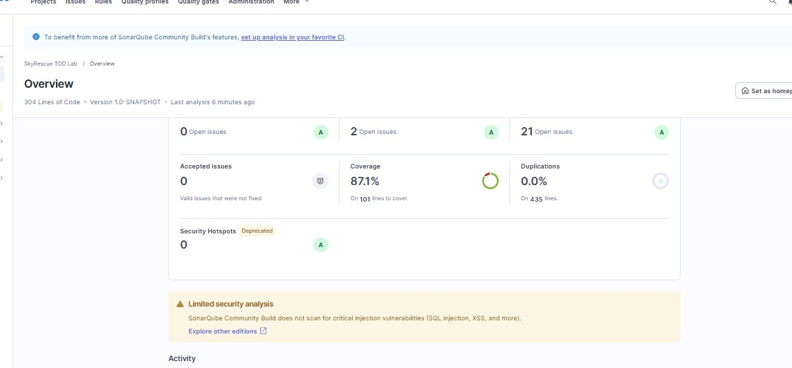

# SkyRescue TDD

## Integrantes

- Nicolas Delgado
- Santiago Gomez
- Diego Mesa

## Evidencia de cobertura

### Primera ejecución

### Cobertura final

## Descripción de SkyRescue

SkyRescue es una plataforma de coordinación de drones para operaciones de emergencia urbana.
Resuelve el problema de gestionar eficientemente drones que transportan kits médicos, cámaras
térmicas y radios hacia zonas de difícil acceso. Las reglas principales del dominio garantizan
que un dron ocupado no pueda ser reasignado, que la distancia de la misión no supere la autonomía
del dron, que un operador no pueda tener dos misiones activas simultáneamente y que una misión
completada no pueda cerrarse nuevamente. Las tres operaciones desarrolladas con TDD son:
`addDrone`, que registra un dron en el centro; `assignMission`, que asigna una misión a un
operador y un dron disponible; y `completeMission`, que cierra una misión activa y libera el dron.

## Evidencia TDD

### Ciclo TDD - completeMission

**RED:** prueba que demuestra que `completeMission` falla sin implementación.

**GREEN:** implementación mínima que hace pasar las pruebas.

**REFACTOR:** se extrajo el método privado `findMissionById` para simplificar y mejorar
la legibilidad de `completeMission`, sin modificar su comportamiento.

## Análisis estático - SonarQube

El análisis se ejecutó localmente con SonarQube Community Build (26.9.0.129388) sobre el
proyecto `skyrescue-tdd`, integrado mediante `sonar-maven-plugin` y el reporte de cobertura
de JaCoCo.

**Resultados:**
- Quality Gate: **Passed** ✅
- Cobertura: **87.1%** (101 líneas a cubrir)
- Duplicaciones: 0.0%
- Issues abiertos: 0 Security, 2 Reliability, 21 Maintainability

